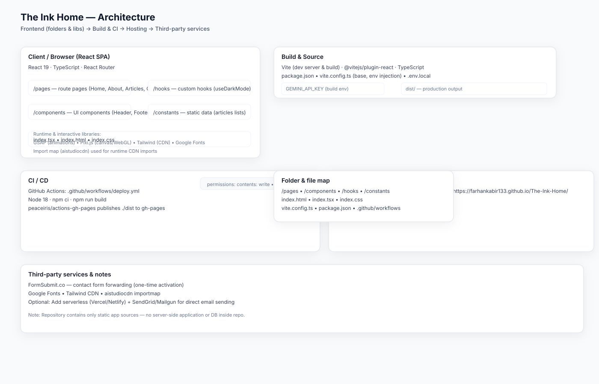

# Architecture — Embedded Diagram

Click the image to open the full SVG (vector):

Files:
- `docs/ARCHITECTURE.md` — textual summary and diagram legend
- `docs/ARCHITECTURE_DIAGRAM_POLISHED.svg` — high-fidelity SVG diagram
- `docs/EXPORT_DIAGRAM.md` — instructions to export SVG → PNG

If you want me to embed the SVG into the project root `README.md` directly, say “embed into README” and I’ll retry the patch (I can also commit a PNG if you want a raster image included).